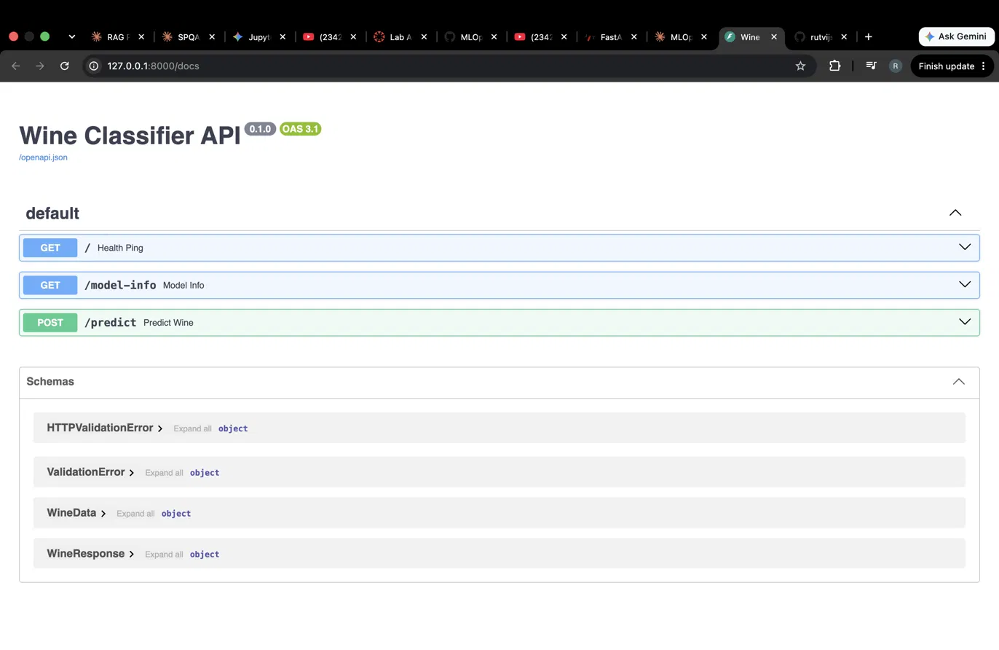
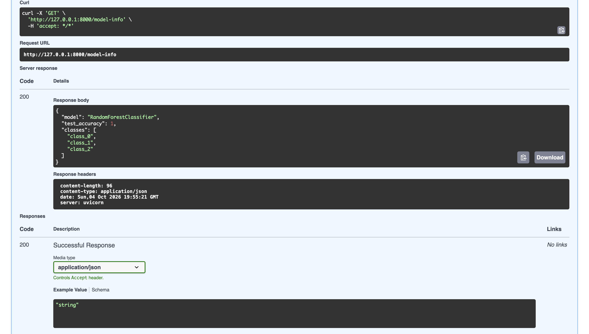
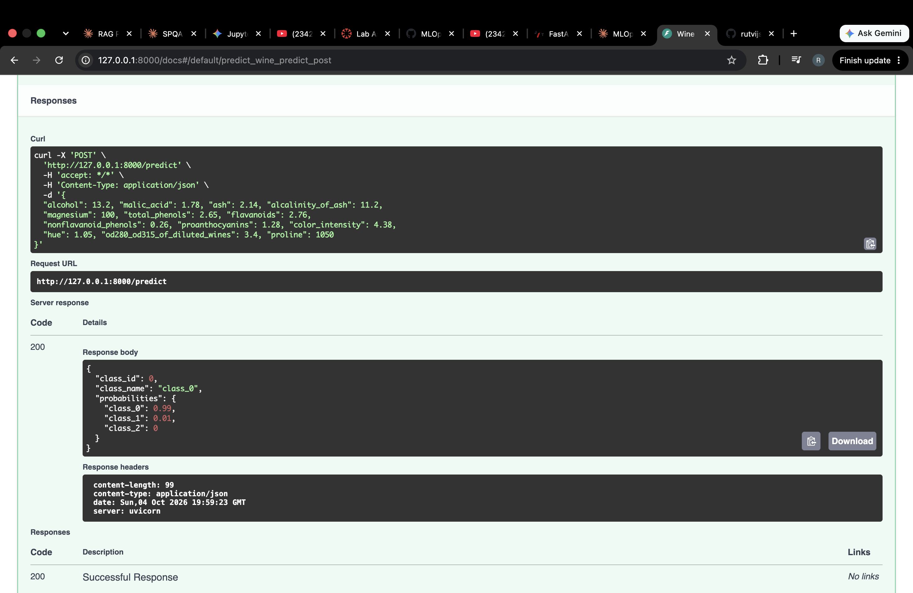
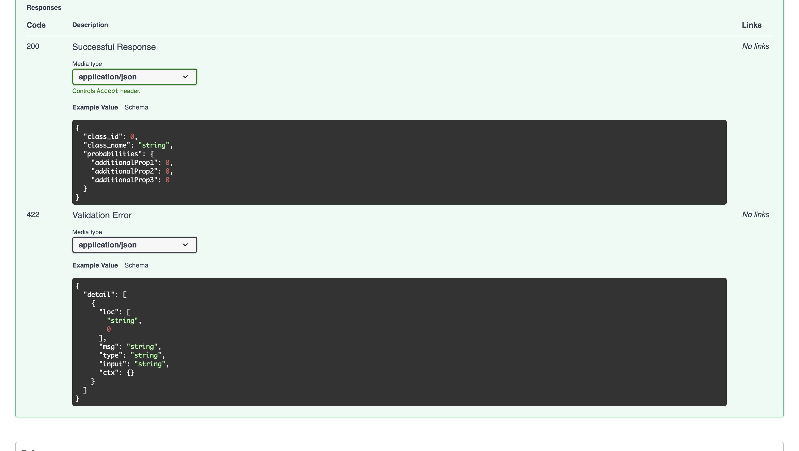

# FastAPI Lab 1: Wine Classifier API

**Author:** Rutvij Surti

Modified version of the [FastAPI Lab](https://github.com/raminmohammadi/MLOps/tree/main/Labs/API_Labs/FastAPI_Labs) from the MLOps course at Northeastern University.

## Overview
This lab trains a Random Forest classifier on the scikit-learn Wine dataset and serves it as a REST API using FastAPI and uvicorn.

## Changes from the Original Lab

| Area | Original | This Version |
|---|---|---|
| Dataset | Iris (4 features) | Wine (13 chemical features, 3 classes) |
| Model | Decision Tree | Random Forest (100 trees) |
| Response | Class ID only | Class ID, class name, and per-class probabilities |
| Input validation | Type checks only | Pydantic `Field` constraints (no negative values) |
| Error handling | None | `HTTPException` returns a 500 with details on failure |
| Endpoints | `/`, `/predict` | Adds `/model-info` (model type, test accuracy, classes) |
| Docs | `uvicorn app:main` typo | Corrected to `uvicorn main:app` |

## Project Structure
```
├── assets/          # Screenshots
├── model/
│   └── wine_model.pkl
├── src/
│   ├── __init__.py
│   ├── data.py      # Loads and splits the Wine dataset
│   ├── train.py     # Trains and saves the Random Forest
│   ├── predict.py   # Loads the model and runs predictions
│   └── main.py      # FastAPI app and endpoints
├── requirements.txt
└── README.md
```

## Setup
```bash
python3 -m venv venv
source venv/bin/activate   # Windows: venv\Scripts\activate
pip install -r requirements.txt
```

## Run
```bash
cd src
python train.py
uvicorn main:app --reload
```
Open http://127.0.0.1:8000/docs to test the endpoints.

## Endpoints

| Method | Endpoint | Description |
|---|---|---|
| GET | `/` | Health check |
| GET | `/model-info` | Model type, test accuracy, class names |
| POST | `/predict` | Predicts wine class from 13 features |

### Example request
```json
{
  "alcohol": 13.2, "malic_acid": 1.78, "ash": 2.14, "alcalinity_of_ash": 11.2,
  "magnesium": 100, "total_phenols": 2.65, "flavanoids": 2.76,
  "nonflavanoid_phenols": 0.26, "proanthocyanins": 1.28, "color_intensity": 4.38,
  "hue": 1.05, "od280_od315_of_diluted_wines": 3.4, "proline": 1050
}
```

### Example response
```json
{
  "class_id": 0,
  "class_name": "class_0",
  "probabilities": {"class_0": 0.99, "class_1": 0.01, "class_2": 0.0}
}
```

## Screenshots

**API docs**


**Model info**


**Prediction (200)**


**Validation error (422)**

